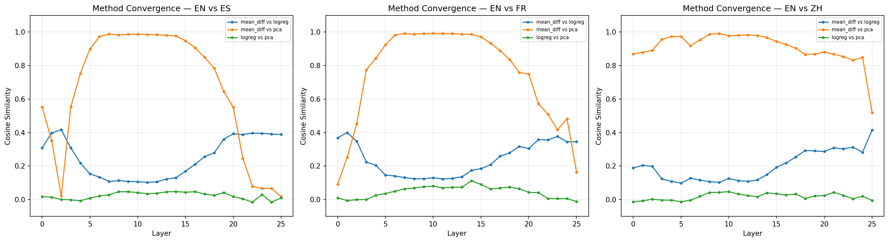
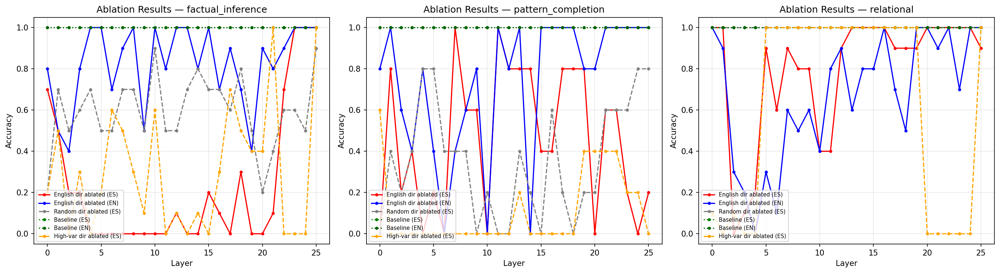

# English Interlingua Causal Ablation
## Do Multilingual LLMs Think in English?

**Model:** Gemma-3-1B-IT (26 layers, instruction-tuned)
**Languages:** English vs. Spanish, French, Chinese
**Method:** Directional ablation via TransformerLens

Shawn Huang
CS 601R — Final Project

---

## Motivation

- Large language models are trained on **predominantly English** data, yet perform well in dozens of languages
- **Key question:** Do these models internally translate non-English inputs into English-like representations before reasoning?
- The **English interlingua hypothesis**: English serves as a shared internal "language of thought"
- **Why it matters:**
  - Reveals whether multilingual ability is genuine or English-mediated
  - Has implications for low-resource language performance and bias

---

## Background: The Interlingua Hypothesis

**Prior work** (e.g., Representation Engineering, LAT) has shown:
- Linear directions in activation space encode high-level concepts (honesty, sentiment)
- These directions can be extracted and manipulated

**My approach — Causal ablation:**
1. Extract a linear "English direction" from the residual stream
2. Surgically remove it at each layer
3. Test whether non-English reasoning breaks while English reasoning survives

If Spanish reasoning **requires** the English direction but English reasoning does not, this is **causal evidence** for the interlingua hypothesis.

---

## Experimental Overview

<!--  -->

| Component | Detail |
|---|---|
| **Model** | Gemma-3-1B-IT (26 layers) |
| **Direction Data** | FLORES-200 (500 parallel sentence pairs per language pair) |
| **Language Pairs** | EN-ES, EN-FR, EN-ZH |
| **Reasoning Tasks** | Factual inference, relational reasoning, pattern completion (50 examples each) |
| **Extraction Methods** | Mean-difference, PCA, logistic regression |
| **Ablation Formula** | $r' = r - (r \cdot \hat{d})\hat{d} + \mu\hat{d}$ |

<!-- Placeholder: Replace with a pipeline diagram if available -->

---

## Step 1: Direction Extraction

Three methods to extract the "English direction" at each of 26 layers:

| Method | Approach | Intuition |
|---|---|---|
| **Mean-diff** | $\hat{d} = \text{mean}(\text{EN}) - \text{mean}(\text{Other})$ | Centroid-to-centroid direction |
| **PCA** | First PC of paired differences $\text{EN}_i - \text{Other}_i$ | Dominant variance axis |
| **Logreg** | Weight vector of logistic regression classifier | Optimal classification boundary |

**Pipeline:** Residual stream activations → mean-pool over content tokens → mean-center → extract direction → validate on held-out set

Applied to **3 language pairs** (EN-ES, EN-FR, EN-ZH) × **26 layers** = 234 directions

---

## Step 1 Results: Method Convergence

<!-- Placeholder: Insert results/plots/convergence.png -->
<!-- **[INSERT FIGURE: convergence.png]** -->

**Key finding:** Mean-diff and PCA converge to the **same direction** at middle layers

| Method Pair | Layers 6–14 (Middle) | Early (L0–L3) | Late (L21–L25) |
|---|---|---|---|
| mean_diff vs. PCA | **0.97–0.99** | 0.02–0.55 | 0.02–0.25 |
| mean_diff vs. logreg | 0.10–0.15 | 0.31–0.42 | 0.39–0.42 |
| logreg vs. PCA | 0.02–0.05 | -0.02–0.02 | -0.02–0.04 |

Logreg finds a **categorically different** direction, nearly orthogonal to mean_diff/PCA.

---

## Classification Accuracy

<!-- Placeholder: Insert results/plots/classification_accuracy.png -->
<!-- **[INSERT FIGURE: classification_accuracy.png]** -->

| Method | EN-ES (Best) | EN-FR (Best) | EN-ZH (Best) |
|---|---|---|---|
| **Logreg** | **0.884** (L20–22) | **0.888** (L22) | **0.888** (L20) |
| **Mean_diff** | **0.868** (L24) | **0.848** (L25) | **0.676** (L25) |
| **PCA** | 0.580 (L7) | 0.604 (L7) | 0.600 (L14) |

**Paradox:** Logreg classifies best but finds a direction **orthogonal** to the causally relevant one. PCA is near-chance at classification but captures the **geometrically universal** direction.

**Implication:** Classification accuracy ≠ causal relevance.

---

## Phase 1 Results: Cross-Language Universality

<!-- Placeholder: Insert results/plots/cross_language_consistency.png -->
**[INSERT FIGURE: cross_language_consistency.png]**

Is the English direction the **same** regardless of which non-English language is used?

| Method | ES vs FR | ES vs ZH | FR vs ZH | Peak Layers |
|---|---|---|---|---|
| **PCA** | **0.9999** | **0.9996** | **0.9993** | L3–L22 (>0.99) |
| **Mean_diff** | **0.9971** | **0.9777** | **0.9846** | L5–L14 (>0.95) |
| **Logreg** | 0.649 | 0.424 | 0.445 | No clear peak |

**PCA yields a near-perfectly universal English direction** — the same linear direction separates English from Spanish, French, *and* Chinese at layers 3–22. This is strong evidence for a **language-general** "English vs. not-English" feature.

---

## Phase 2: Reasoning Dataset Construction

Three bilingual reasoning task types, filtered so the model answers correctly in **both EN and ES**:

| Task Type | N | Example |
|---|---|---|
| **Factual Inference** | 50 | "All of Elena's fish are gray. Elena has a fish named Carlos. What color is Carlos?" |
| **Relational Reasoning** | 50 | "If Isabel is faster than Lucia, and Lucia is faster than Ana, who is the least fast?" |
| **Pattern Completion** | 50 | "What comes next: 2, 4, 6, 8, 10, ?" |

- Generated 150 candidates per task → filtered to 50 bilingual-correct
- 100% baseline accuracy in both EN and ES at all layers (unablated)
- Ensures any accuracy drop under ablation is due to the intervention, not baseline failure

---

## Phase 3: Causal Ablation — Setup

**Ablation formula at each layer:**
$$r' = r - (r \cdot \hat{d})\hat{d} + \mu\hat{d}$$

Remove the English direction component, replace with the Spanish population mean.

**Six experimental conditions per layer:**

| Condition | Description | Purpose |
|---|---|---|
| `en_ablated_es` | Ablate English dir → test Spanish | **Key test** |
| `en_ablated_en` | Ablate English dir → test English | Language control |
| `random_ablated_es` | Ablate random dir → test Spanish | Null control |
| `baseline_es` / `baseline_en` | No ablation | Baselines (always 100%) |
| `high_var_ablated_es` | Ablate high-var non-English PC → test Spanish | Specificity control |

---

## Phase 3: Factual Inference — The Central Result

<!-- Placeholder: Insert results/plots/accuracy_curves.png (factual panel) -->
**[INSERT FIGURE: accuracy_curves.png — factual inference panel]**

The **strongest evidence** for the English interlingua hypothesis:

| Layer Range | Spanish (en_ablated) | English (en_ablated) | Random Control |
|---|---|---|---|
| L0–L3 | 0.2–0.7 | 0.4–0.8 | 0.2–0.6 |
| **L4–L21** | **~0.0** | **~0.8–1.0** | **~0.5–0.9** |
| L22–L25 | 0.7–1.0 | 0.9–1.0 | 0.5–0.9 |

At layers 4–21: **Spanish accuracy drops to 0%** while **English accuracy stays at 80–100%**.

---

## Factual Inference: The Asymmetry

<!-- Placeholder: Insert a bar chart or highlight table showing the asymmetry -->
**[INSERT FIGURE: factual inference asymmetry visualization]**

**Three critical controls rule out alternative explanations:**

1. **Not generic disruption:** Random direction ablation → Spanish accuracy averages 0.58 (far above 0%)
2. **Not general reasoning damage:** English accuracy preserved at 80–100% under the same ablation
3. **Broad layer range:** Effect spans L4–L21 (~70% of network depth), not a narrow bottleneck

**Interpretation:** The model **routes Spanish factual reasoning through English-like representations**. Removing this pathway collapses Spanish reasoning while leaving English reasoning intact.

---

## Phase 3: Relational Reasoning

<!-- Placeholder: Insert results/plots/accuracy_curves.png (relational panel) -->
**[INSERT FIGURE: accuracy_curves.png — relational reasoning panel]**

| Layer Range | Spanish (en_ablated) | English (en_ablated) | Random Control |
|---|---|---|---|
| L0–L1 | 1.0 | 0.95 | 1.0 |
| **L2–L4** | **0.1** | **0.17** | **1.0** |
| L5–L9 | 0.8 | 0.40 | 1.0 |
| L10–L15 | 0.4–0.97 | 0.60–0.77 | 1.0 |

**Qualitatively different pattern:** Both Spanish *and* English degrade at L2–L4.

The English direction at early layers encodes **general reasoning features** shared across languages, not just cross-lingual transfer. Weaker support for the interlingua hypothesis for this task.

---

## Phase 3: Pattern Completion

<!-- Placeholder: Insert results/plots/accuracy_curves.png (pattern panel) -->
**[INSERT FIGURE: accuracy_curves.png — pattern completion panel]**

| Layer Range | Spanish (en_ablated) | English (en_ablated) | Random Control |
|---|---|---|---|
| L0–L6 | 0.23 | 0.46 | 0.37 |
| L7–L14 | 0.60 | 0.56 | 0.20 |
| **L15–L25** | **0.32–0.43** | **0.93–1.0** | **0.28–0.68** |

- **Small sample size** (n=5 per layer) causes high noise
- At L15–L25: suggestive asymmetry (English preserved, Spanish degraded)
- Numerical reasoning may **partially bypass** linguistic representations

---

## Phase 3 Summary: Task Comparison

| Task | Interlingua Evidence | Key Pattern |
|---|---|---|
| **Factual Inference** | **Strong** | Asymmetric: ES collapses, EN preserved |
| **Relational Reasoning** | **Weak** | Symmetric: both ES and EN degrade |
| **Pattern Completion** | **Suggestive** | Mild asymmetry at late layers, high noise |

**Interpretation:** The interlingua hypothesis is most applicable to **language-heavy** reasoning tasks (factual inference requires parsing natural language premises and conclusions). Tasks with strong **non-linguistic structure** (numerical patterns) may partially bypass the English representation pathway.

---

## Phase 4: Activation Topology — Heatmaps

<!-- Placeholder: Insert results/plots/colormap_factual_inference_0.png -->
**[INSERT FIGURE: colormap_factual_inference_0.png]**

**The `<bos>` token dominates the English direction signal:**

| Position | Peak Projection (L13–L18) |
|---|---|
| **`<bos>` token** | **40,000–50,000** |
| Content tokens (e.g., "Todos", "Elena") | < 5,000 |

The model uses the beginning-of-sequence token as a **language identity register** — it encodes "this is non-English input" information that propagates through subsequent processing via attention.

---

## Phase 4: Mean Projection Profile

<!-- Placeholder: Insert results/plots/mean_projection_profile.png -->
**[INSERT FIGURE: mean_projection_profile.png]**

The English-direction projection follows a **bell-shaped curve** across layers:

| Layer Range | Mean Projection | Role |
|---|---|---|
| L0–L2 | ~0 | Raw embeddings, language not separated |
| L3–L14 | Rising (→ ~7,900) | Language encoding builds up |
| **L15–L18** | **Peak (~7,500–8,000)** | **Maximum English-direction activation** |
| L19–L23 | Declining | Transition to output |
| L24–L25 | Secondary rise (~2,200–3,300) | Output-layer features |

The causal disruption range (L4–L21) **directly mirrors** where the direction is most prominent.

---

## Conclusion A: Evidence For the Interlingua Hypothesis

The factual inference results provide the **strongest causal evidence**:

1. **Asymmetric disruption** — Ablating the English direction at L4–L21 reduces Spanish accuracy to ~0% while English remains ~80–100%

2. **Specificity** — Random direction ablation does not produce this effect (avg 0.58 accuracy)

3. **Universality** — The PCA-extracted direction is nearly identical across EN-ES, EN-FR, EN-ZH (cosine > 0.99)

4. **Spatial coherence** — The causal role coincides with the layer range where the direction is geometrically strongest

**The model routes Spanish factual reasoning through English-like representations.**

---

## Conclusion B: Task-Dependent Interlingua Reliance

Not all reasoning tasks rely equally on the English interlingua:

- **Factual inference** (language-heavy, deductive chains): **Strong** English dependence
- **Relational reasoning** (transitive comparisons): Uses **language-general** circuits that overlap with but are not mediated by the English direction
- **Pattern completion** (numerical sequences): May **partially bypass** linguistic representations

**Implication:** The interlingua hypothesis is most relevant for tasks requiring deep natural language processing, not for tasks with strong non-linguistic structure.

---

## Conclusion C: Direction Methods Tell Different Stories

| Property | PCA | Mean-diff | Logreg |
|---|---|---|---|
| **Cross-language universality** | >0.99 | >0.95 (middle layers) | 0.30–0.65 |
| **Classification accuracy** | ~0.55 (near chance) | ~0.87 (late layers) | ~0.88 |
| **Convergence with PCA** | — | 0.97–0.99 | 0.02–0.05 |
| **Causal relevance** | **High** | **High** | **Low** |

**Key insight:** Classification accuracy is an **insufficient criterion** for selecting directions for causal intervention. The geometrically dominant direction (PCA/mean-diff) — not the classification-optimal one (logreg) — is the causally relevant one.

---

## Conclusion D: `<bos>` Token as Language Register

<!-- Placeholder: Insert a colormap showing BOS dominance -->
**[INSERT FIGURE: colormap showing BOS token dominance]**

- The `<bos>` token carries **10–100x** more English-direction signal than content tokens
- The model encodes language identity in a **position-specific** manner
- The beginning-of-sequence token acts as a **global context register** for language mode
- Ablation modifies the `<bos>` representation → influences all downstream processing through attention
- Consistent with instruction-tuned models using sequence-initial context to set up language-specific modes

---

## Conclusion E: Layer-Depth Profile

| Layer Range | Direction Quality | Cross-Lang Consistency | Causal Impact |
|---|---|---|---|
| **L0–L3** (Early) | Low convergence | Low–High | Moderate |
| **L4–L14** (Middle) | High (>0.97) | Very high (>0.95) | **Maximum** |
| **L15–L20** (Upper-mid) | Declining | Declining | Strong |
| **L21–L25** (Late) | Low | Low–Moderate | **None** |

The causal importance of the English direction **mirrors its geometric quality**: ablation is most destructive where the direction is most well-defined and universal.

---

## Limitations

1. **Small ablation sample sizes** — 10 examples/layer (factual/relational), 5 examples/layer (pattern completion)
2. **Single model** — Gemma-3-1B-IT only; may not generalize to larger or non-instruction-tuned models
3. **Single random control** — N=1 random direction (compute constraints); more baselines would strengthen null control
4. **Mean-diff direction only** for ablation — PCA (higher cross-language consistency) untested
5. **Only EN-ES reasoning** tested — French and Chinese causal effects remain unverified

---

## Summary of Key Quantitative Findings

| Finding | Metric | Value |
|---|---|---|
| Method convergence (middle layers) | cos(mean_diff, PCA) | **0.97–0.99** |
| PCA cross-language universality | cos(ES-dir, FR-dir) | **>0.99** at L3–L22 |
| Logreg classification accuracy | held-out accuracy | **0.88** |
| PCA classification accuracy | held-out accuracy | **~0.55** |
| Factual: Spanish after ablation (L4–21) | accuracy | **~0.0** |
| Factual: English after ablation (L4–21) | accuracy | **~0.82** |
| Factual: random control (L4–21) | accuracy | **~0.58** |
| English activation peak | projection magnitude | **~7,900** at L16 |
| BOS vs content token ratio | projection ratio | **10–100x** |

---

## Thank You

**Summary:** We provide causal evidence that Gemma-3-1B-IT routes Spanish factual reasoning through English-like internal representations — supporting the English interlingua hypothesis for language-heavy reasoning tasks.

**Code & Data:** All scripts, directions, ablation results, and plots available in the project repository.

**References:**
- Representation Engineering (Zou et al., 2023)
- Linear Artificial Tomography (LAT)
- TransformerLens (Neel Nanda)
- FLORES-200 (NLLB Team)
